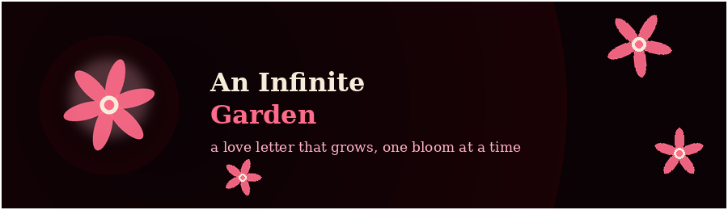

<p align="center">
  
</p>

<h1 align="center">An Infinite Garden 🌸</h1>

<p align="center">
  A password-protected, multi-scene interactive love letter — plant flowers in a canvas garden, walk through a photo timeline, and read a letter that unlocks with a press-and-hold gesture.
</p>

<p align="center">
  <a href="https://infinite-gardens.netlify.app/"></a>
  
  
  
  
</p>

<p align="center">
  <strong>🔗 Live Demo:</strong> <a href="https://infinite-gardens.netlify.app/">infinite-gardens.netlify.app</a>
</p>

---

> **🔑 Demo password:** the live demo is gated behind a lock screen. Enter **`12345`** to unlock it. See the [Password Protection](#-password-protection) section below for where to change it.

---

> **Privacy note:** This is the public, GitHub-safe version of a commissioned personal gift site. All real photos and audio from the original delivery have been removed, the site password and relationship start date were reset to placeholders, and personal names were replaced with generic terms — see [Privacy & Content](#-privacy--content) below.

---

## 📑 Table of Contents

- [Features](#-features)
- [Scene Flow](#-scene-flow)
- [Project Structure](#-project-structure)
- [Configuration](#%EF%B8%8F-configuration)
- [Password Protection](#-password-protection)
- [Logo & Favicon](#-logo--favicon)
- [Adding Your Own Media](#-adding-your-own-media)
- [Run Locally](#-run-locally)
- [Privacy & Content](#-privacy--content)
- [License](#-license)
- [Author](#-author)

---

## ✨ Features

- 🔒 **Password-gated entry** — a lock screen before the experience begins
- 🌷 **Interactive garden** — click anywhere to grow one of five hand-drawn flower types (lily, rose, sunflower, tulip, and a generic bloom), all rendered live on `<canvas>`
- ⏱️ A **live "days since" counter** based on a configurable start date
- 🎨 A **theme selector** to change the garden's accent color
- 🖼️ A **photo gallery** with lightbox viewing
- 💭 A **"Things I Love"** card section
- 📅 A **timeline** of relationship milestones, each with its own image
- ✉️ A **press-and-hold letter scene** with a typewriter reveal
- 🔀 **Two branching endings** ("Remember" / "Leave"), each with its own animated typewriter message
- 🦋 Ambient effects: falling petals, fireflies, and floating hearts
- 🎵 Toggleable background music and a separate voice-message track

---

## 🎬 Scene Flow

```
lock → intro → garden → gallery → things-i-love → timeline → letter → choice → ending (remember / leave)
```

All scene transitions, canvas drawing, and state are handled inside a single `<script>` block in `index.html` — there's no build step or external framework.

---

## 📂 Project Structure

```text
project3/
├── index.html          # Entire app: markup, styles, and all interactive logic in one file
├── favicon.png           # Generated flower badge favicon matching the site's rose/paper palette
└── readme-banner.png      # Banner used at the top of this README
```

This project is intentionally a single self-contained HTML file — everything (styles, canvas drawing, scene logic, and configuration) lives in `index.html` for easy hosting anywhere static files are served.

> The original delivery also referenced `1.jpg`–`10.jpg`, `song.mp3`, and `voice.mp3` in the project root. These were removed for privacy — see [Adding Your Own Media](#-adding-your-own-media) below.

---

## ⚙️ Configuration

Near the top of the `<script>` block in `index.html`, there's a clearly marked configuration section:

```js
const SITE_PASSWORD = "CHANGE_ME";      // change to your own password
const LOVE_START_DATE = '2024-01-01';   // the date your story began
const HER_NAME = "You";                 // used in a couple of messages

const INTRO_LINES = [ ... ];
const GALLERY_PHOTOS = [ ... ];
const THINGS_I_LOVE = [ ... ];
const TIMELINE_EVENTS = [ ... ];
const LETTER_LINES = [ ... ];
const ENDING_MESSAGE = "...";
```

Everything user-facing — the password, the start date, the intro lines, gallery captions, timeline entries, and the letter text — is edited directly in this block. No other part of the file needs to change for a full re-personalization.

---

## 🔒 Password Protection

The site opens on a lock screen and checks whatever visitors type against `SITE_PASSWORD`, set in the same configuration block near the top of the `<script>` tag in `index.html`:

```js
// ⚠️ SITE PASSWORD: this is the password visitors must type on the lock screen to enter the site — change "12345" to whatever you'd like
const SITE_PASSWORD = "12345";      // change to your own password
```

Search for `SITE_PASSWORD` in `index.html` to find and change it (the check is case-insensitive). This lives in plain client-side JavaScript — anyone who views the page source can read it, so treat it as a fun gate for your recipient rather than real security.

---

## 🌸 Logo & Favicon

`favicon.png` and `readme-banner.png` are a generated flower badge built from the site's own `--accent`, `--accent-soft`, and `--paper` CSS variables in `index.html`, so it matches the garden's rose-and-cream palette.

- The favicon is linked in `index.html`: `<link rel="icon" type="image/png" href="./favicon.png">`
- To use your own logo, just replace `favicon.png` with any square image (128×128 or larger).

---

## 🖼️ Adding Your Own Media

Add these files to the project root (same folder as `index.html`):

**Photos** — referenced by `GALLERY_PHOTOS` and `TIMELINE_EVENTS`:
```
1.jpg ... 10.jpg
```
(or update the `src`/`img` fields in the config to point at whatever filenames you use)

**Audio:**
```
song.mp3     # background music
voice.mp3    # optional voice message track
```

---

## ▶️ Run Locally

This is a single static HTML file — no build step or server required.

- Double-click `index.html` to open it directly in a browser, **or**
- Serve it locally:
```bash
python -m http.server 5500
```
Then open `http://localhost:5500`.

---

## 🔐 Privacy & Content

This repository is the **sanitized, shareable version** of a commissioned personal project. Before publishing:

- All original photos (`1.jpg`–`10.jpg`) and audio files (`song.mp3`, `voice.mp3`) were **removed**.
- `SITE_PASSWORD` was reset from the original password to `"CHANGE_ME"`.
- `LOVE_START_DATE` was reset to a placeholder date (`2024-01-01`).
- Personal names in the intro, watermark, gallery captions, and letter were replaced with generic terms (`my love`, `You`).
- A stray `.vscode/launch.json` file (containing a local file path) was removed.

If you're using this as a template, update the configuration block with your own password, date, names, and message text before deploying.

---

## 📄 License

Personal/portfolio project. Feel free to use this as a learning reference or starting template; if you plan to redistribute or resell it, please contact the author first.

---

## 👤 Author

**Christian G. Maranan**
Computer Engineering Student — Major in Machine Learning
at Tanauan City College

- **GitHub:** [@krei-labs](https://github.com/krei-labs)
- **Instagram:** [@krei_in](https://instagram.com/krei_in)
- **Email:** [christianmaranan0303@gmail.com](mailto:christianmaranan0303@gmail.com)

---

<p align="center"><strong>Build. Learn. Experiment.</strong> — kréi / Krei Labs</p>
